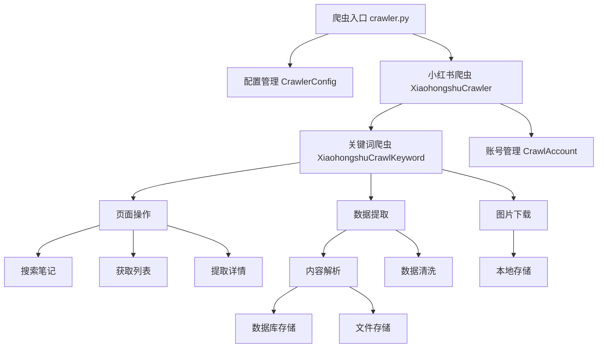
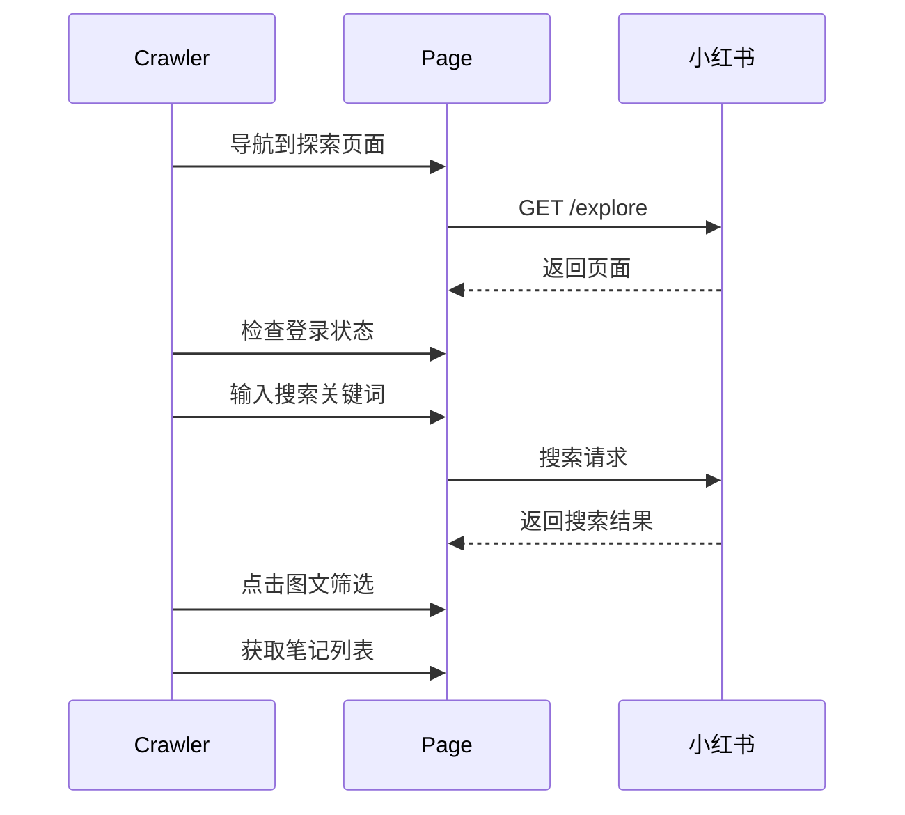

title: 使用 Playwright 构建小红书笔记采集：从架构设计到实战应用
date: 2025-07-18 09:40:30
category: programming
tags: [playwright, python, 爬虫]

---

_**免责声明：本文内容仅用于学习和研究，不建议用于任何其它用途，作者不承担因使用本项目而导致的任何法律问题。**_

## 前言

在当今信息爆炸的时代，小红书作为重要的高质量内容分享平台，蕴含着大量有价值的用户生成内容，特别是在旅游、美食、服装等垂直领域。本文将详细介绍如何使用 Playwright 构建一个高效、稳定的小红书笔记爬虫系统，涵盖架构设计、核心实现和最佳实践。

## 技术栈选择

### 为什么选择 Playwright？

1. **现代化浏览器自动化**：支持 Chromium、Firefox、Webkit 和 Edge
2. **强大的反检测能力**：更接近真实用户行为
3. **异步支持**：天然支持 Python asyncio，性能优异
4. **稳定的元素定位**：提供多种等待策略，支持处理动态内容，支持 XPath、CSS 选择器
5. **网络拦截**：可以监控和修改网络请求

### 核心依赖

项目依赖主要包括：

```python
# 主要依赖
playwright  # 浏览器自动化
httpx      # 异步HTTP客户端，还提供了同步 API，其 API 类似于 requests
aiofiles   # 异步文件操作
crawl4ai   # 本次只用到了它的 HTML 到 Markdown 转换功能
psycopg    # PostgreSQL 数据库连接
sqlmodel   # SQLAlchemy 模型定义
```

可以将上述依赖保存到 `requirements.txt` 文件中，使用 `pip install -r requirements.txt` 进行安装。

## 系统架构设计

### 整体架构



### 核心组件

#### 1. 爬虫主控制器 (XiaohongshuCrawler)

```python
class XiaohongshuCrawler:
  """小红书笔记爬虫主控制器"""

  def __init__(self, config: CrawlerConfig):
    self.config = config
    self.browser: Browser | None = None
    self.playwright: Playwright | None = None
    self.crawl_accounts: list[CrawlAccount] = []
```

**核心职责：**

- 浏览器生命周期管理
- 多账号轮换策略
- 任务调度和分发
- 异常处理和恢复

#### 2. 关键词爬虫 (XiaohongshuCrawlKeyword)

```python
class XiaohongshuCrawlKeyword:
  """单个关键词的爬取逻辑"""

  def __init__(self, site: CrawlSite, crawl_keyword: CrawlKeyword, page: Page):
    self.site = site
    self.crawl_keyword = crawl_keyword
    self.page = page
```

**核心职责：**

- 搜索关键词相关笔记
- 笔记列表获取和筛选
- 笔记详情提取
- 多媒体内容下载

## 核心实现流程

### 1. 浏览器初始化和配置

```python
async def start_browser(self):
  """启动浏览器"""
  self.playwright = await async_playwright().start()
  self.browser = await self.playwright.chromium.launch(
    headless=self.config.site.headless
  )
  logger.info('浏览器启动成功')
```

**关键配置：**

- 用户代理设置
- 视窗大小配置
- Cookie 注入
- 请求头定制

### 2. 搜索流程实现



因为小红书的搜索结果是动态加载的，同时我们只对图文内容感兴趣，所以需要点击图文筛选按钮，再获取笔记列表。若用户对视频内容也感兴趣，也可以不进行筛选以获得所有形式的内容。

#### 搜索实现细节

```python
async def search_notes(self, keyword: str) -> bool:
  """搜索笔记"""
  try:
    # 1. 定位搜索框并输入关键词
    search_input = self.page.locator('.input-box #search-input')
    await search_input.wait_for(state='visible', timeout=10000)
    await search_input.click()
    await search_input.fill(keyword)

    # 2. 点击搜索按钮
    search_btn = self.page.locator('.input-box .search-icon')
    await search_btn.click()
    await self.page.wait_for_timeout(rand_swing_ms(2000))

    # 3. 筛选图文内容
    content_image_btn = self.page.locator('#image')
    await content_image_btn.wait_for(state='visible', timeout=10000)
    await content_image_btn.click()

    return True
  except Exception as e:
    logger.error(f'搜索失败: {e}')
    return False
```

### 3. 笔记详情提取

#### 数据提取策略

小红书的笔记详情弹窗是异步加载的，需要点击笔记打开，再等待弹窗加载完成（小红书不像其它资讯内平台一样打开一个新页面）。

- 点击笔记打开详情弹窗
- 等待详情弹窗加载完成
- 提取基础信息（标题、作者、内容）
- 提取图片信息（包含 URL、本地路径）

```python
async def extract_note_detail(self, note_item_locator: Locator, index: int):
  """提取笔记详情"""
  # 1. 点击笔记打开详情弹窗
  img_link = note_item_locator.locator('a.cover')
  await img_link.evaluate('elem => elem.click()')  # 使用 JS 避免遮罩层干扰

  # 2. 等待详情的弹窗容器加载
  note_container = self.page.locator('.note-container')
  await note_container.wait_for(state='visible', timeout=10000)

  # 3. 提取笔记ID
  note_id = self._extract_note_id_from_url(self.page.url)

  # 4. 提取基础信息
  title = await note_container.locator('.note-content .title').inner_text()
  author = await note_container.locator('.author-container .username').inner_text()
  content = await note_container.locator('.note-content .desc').inner_html()

  # 5. 提取图片信息
  image_urls = await self._extract_image_urls(note_container)

  return OriginalPageBase(...)
```

直接在 `img_link` 上调用 `.click()` 方法有时候会失效，因为它可能被遮罩层遮挡。所以这里直接使用 JS 代码进行点击。将一段 JS 代码字符串传入 `evaluate` 方法执行，箭头函数里的 `elem` 参数就是 `img_link` 元素。

`OriginalPageBase` 是使用 [Pydantic 的 BaseModel](https://docs.pydantic.dev/) 定义的一个数据类，用于保存抓取的各类信息，它的定义如下：

```python
class OriginalPageBase(SQLModel):
  """文章数据模型"""

  crawl_keyword_id: int = Field(sa_type=BigInteger, foreign_key='crawl_keyword.id', description='抓取关键词ID')
  page_id: str | None = Field(default=None, max_length=255, description='文章ID')
  crawl_url: str = Field(max_length=2048, description='要爬取的url')
  url: str = Field(max_length=2048, description='文章原始实际访问的url')
  title: str = Field(max_length=255, description='文章标题')
  author: str = Field(max_length=255, description='文章作者')
  publish_time: datetime | None = Field(default=None, description='发布时间')
  content: str = Field(sa_type=Text, description='文章内容（HTML格式）')
  markdown: str = Field(sa_type=Text, description='文章内容（Markdown格式）')
  images: list[ImageInfo] = Field(default_factory=list, sa_type=JsonArrayImageInfo, description='文章图片列表')
  ctime: datetime = Field(description='创建（抓取）时间', default_factory=datetime.now)
  mtime: datetime | None = Field(description='更新时间', default=None)

  def clean_data(self, tail_images: bool = False) -> Self:
    """清理数据"""
    # ....
    return self

  def _generate_markdown(self, markdown: str, has_metadata: bool, tail_images: bool) -> str:
    """生成Markdown内容"""
    # ....
    return markdown


class OriginalPage(OriginalPageBase, table=True):
  """原始页面数据模型"""

  __tablename__ = 'original_page'

  id: int = Field(default=None, sa_type=BigInteger, primary_key=True)
```

#### 图片提取优化

```python
async def _extract_image_urls(self, note_container: Locator) -> list[str]:
  """提取笔记中的所有图片URL"""
  image_urls = []

  # 定位轮播图容器
  swiper_wrapper = note_container.locator('.swiper-wrapper')

  # 获取非重复的图片元素
  img_elements = await swiper_wrapper.locator(
      'div[data-swiper-slide-index]:not(.swiper-slide-duplicate) img'
  ).all()

  for img_element in img_elements:
    src = await img_element.get_attribute('src')
    if src and src not in image_urls:
      image_urls.append(src)

  return image_urls
```

在获取 `img_elements` 时，使用了 CSS 选择器 `:not(.swiper-slide-duplicate)` 来筛选非重复的图片元素。这是因为轮番图片组件的 **前一张** 和 **下一张** 图片是重复的，所以需要过滤掉。当然，我们也可以在获取所有图片链接后再手动去重。

### 4. 多媒体内容下载

```python
async def _download_images(self, note_id: str, images: list[ImageInfo]):
  """异步下载图片"""
  base_dir = os.path.join(self.crawl_keyword.output_dir, note_id)
  os.makedirs(base_dir, exist_ok=True)

  async with httpx.AsyncClient(
    headers=self.site.extra_http_headers,
    timeout=httpx.Timeout(self.crawl_keyword.request_timeout or 30)
  ) as client:
    for i, image_info in enumerate(images):
      filename = f'{note_id}_{i + 1}.{self.crawl_keyword.image_format}'
      filepath = os.path.join(base_dir, filename)

      await self._download_single_image(client, image_info.src, filepath)
      image_info.local_path = filepath
      image_info.filename = filename
```

## 反反爬策略

### 1. 行为模拟

```python
# 随机延时
await self.page.wait_for_timeout(rand_swing(500, 1500))

# 模拟人工操作
await search_input.click()  # 先点击获得焦点
await search_input.fill(keyword)  # 再输入内容

# 使用JS直接操作避免检测
await img_link.evaluate('e => e.click()')
```

### 2. 请求头伪装

```python
extra_http_headers = {
  'User-Agent': 'Mozilla/5.0 (Macintosh; Intel Mac OS X 10_15_7) ...',
  'Accept': 'text/html,application/xhtml+xml,application/xml;q=0.9,*/*;q=0.8',
  'Accept-Language': 'zh-CN,zh;q=0.9,en;q=0.8',
  'Accept-Encoding': 'gzip, deflate, br',
}
```

### 3. 多账号轮换

```python
def _get_crawl_account(self) -> CrawlAccount:
  """轮换获取爬虫账号"""
  if not self.crawl_accounts:
    self._set_crawl_accounts()

  crawl_account = self.crawl_accounts[
    self.crawl_accounts_index % len(self.crawl_accounts)
  ]
  self.crawl_accounts_index += 1
  return crawl_account
```

## 数据处理和存储

### 1. 内容清洗

[`DefaultMarkdownGenerator`](https://docs.crawl4ai.com/core/quickstart/#example-using-a-filter-with-defaultmarkdowngenerator) 是由 [crawl4ai](https://docs.crawl4ai.com/) 提供的 Markdown 生成器，它可以将 HTML 内容转换为 Markdown 格式。

```python
def _generate_markdown_from_html(self, html_content: str) -> str:
  """HTML 转 Markdown"""
  md_gen = DefaultMarkdownGenerator()

  res = md_gen.generate_markdown(
    input_html=html_content,
    base_url='https://xiaohongshu.com',
    options={
      'ignore_links': True,
      'ignore_images': True,
    }
  )

  return res.fit_markdown or res.raw_markdown or ''
```

因为生成的 Markdown 内容可能用于后续 LLM/RAG 的进一步处理，所以我们只需要保留文本内容即可。图片内容已经单独下载，所以这里只需要保留文本即可。

### 2. 多格式存储

采集的小红书笔记可存储为数据库、JSON 格式和 Markdown 格式，下面是相关代码实现：

```python
# 数据库存储
if self.crawl_keyword.save_as_db:
  with with_session() as session:
    original_page_svc = OriginalPageSvc(session)
    original_page_svc.create_original_page(original_page)

# JSON格式存储
if self.crawl_keyword.save_as_json:
  async with aiofiles.open(json_path, 'w', encoding='utf-8') as f:
    await f.write(original_page.model_dump_json(indent=2))

# Markdown格式存储
if self.crawl_keyword.save_as_markdown:
  async with aiofiles.open(md_path, 'w', encoding='utf-8') as f:
    await f.write(original_page.markdown)
```

## 错误处理和监控

### 1. 异常处理策略

我们在采集小红书笔记时，可能会遇到一些异常情况，比如网络错误、页面加载失败等。为了确保采集的完整性，我们需要对异常情况进行处理。

```python
try:
  original_page = await self.extract_note_detail(note_item, i)
  if original_page:
    notes.append(original_page)
    await self.save_note(original_page)
except Exception:
  logger.error(f'处理笔记失败 index: {i}, url: {self.page.url}', exc_info=True)
  # 保存错误页面用于调试
  error_dir = os.path.join(self.output_dir, 'errors')
  await save_page(self.page, error_dir, f'error_{i}')
```

单采集出现异常时，会将异常页面的 HTML 文本和截图保存到 `errors` 目录下，方便后续排查问题。

```python
async def save_page(page: Page, output_dir: str, keyword: str):
  try:
    safe_keyword = keyword.replace('/', '_').replace('\\', '_')
    now = datetime.now().strftime('%Y%m%d%H%M%S')
    # 文件名格式: 关键词_时间戳.png，防止重复
    filename = f'{safe_keyword}_{now}'

    filepath = os.path.join(output_dir, f'{filename}.png')
    await page.screenshot(path=filepath, full_page=True)
    logger.info(f'已保存完整页面截图: {filepath}')

    filepath = os.path.join(output_dir, f'{filename}.html')
    with open(filepath, 'w', encoding='utf-8') as f:
      f.write(await page.content())  # 保存页面 HTML
    logger.info(f'已保存页面 HTML: {filepath}')
  except Exception as e:
    logger.error(f'保存页面截图失败: {e}')
```

在使用 `page.screenshot` 截图时需要注意添加 `full_page=True` 参数，不然默认只会截取可见区域。

### 2. 登录状态检测

小红书需要登录后才能访问，所以在采集前需要先检查登录状态。

```python
async def check_login(self):
  """检查登录状态"""
  login_container = self.page.locator('.login-container')
  login_btn = login_container.get_by_role('button', name='登录')
  if await login_btn.is_visible():
    raise Exception('未登录，需要登录访问')
```

## 性能优化

### 1. 并发控制

```python
# 使用信号量控制并发数
semaphore = asyncio.Semaphore(3)  # 最多3个并发任务

async def process_with_semaphore(note_item):
  async with semaphore:
    return await self.extract_note_detail(note_item)
```

### 2. 资源复用

复用浏览器上下文。这里调用 `context.add_cookies` 方法，将登录后的 Cookie 信息添加到上下文，避免每次采集都需要重新登录。用户登录的 Cookie 可以通过 Chrome 的 [Cookie-Editor](https://chromewebstore.google.com/detail/cookie-editor/hlkenndednhfkekhgcdicdfddnkalmdm) 插件导出。

```python
async with await self.browser.new_context() as context:
  await context.add_cookies(crawl_account.to_cookies())
  for keyword in keywords:
    await self._run_crawl_keyword(context, keyword)
```

### 3. 内存管理

使用 `with` 语句管理页面生命周期，就算程序抛出异常，它也能确保页面在使用后及时关闭并释放内存。

```python
# 及时关闭页面释放内存
async with await context.new_page() as page:
  # 爬取逻辑
  pass  # 页面会自动关闭
```

## 部署

### 1. Docker 部署

```dockerfile
FROM python:3.13-slim

# 安装 Playwright 依赖
RUN apt-get update && apt-get install -y \
    wget \
    gnupg \
    && rm -rf /var/lib/apt/lists/*

# 安装 Python 依赖
COPY requirements.txt .
RUN pip install -r requirements.txt

# 安装浏览器
RUN playwright install chromium
RUN playwright install-deps

COPY . /app
WORKDIR /app

CMD ["python", "-m", "aiguide.app.crawler"]
```

## 最佳实践总结

### 1. 开发建议

- **渐进式开发**：先实现基础功能，再逐步优化
- **充分测试**：在不同网络环境下测试稳定性
- **日志完善**：记录关键操作和异常信息
- **配置外置**：将爬取参数配置化，便于调整

### 2. 运维建议

- **定期更新**：跟进目标网站的页面结构变化
- **账号轮换**：避免单账号频繁请求被限制
- **数据备份**：定期备份爬取的数据
- **合规使用**：遵守网站的 robots.txt 和使用条款

### 3. 扩展方向

- **分布式部署**：使用消息队列实现任务分发
- **智能调度**：根据网站负载动态调整爬取频率
- **数据分析**：对爬取的内容进行情感分析、主题提取等
- **实时监控**：集成 Prometheus + Grafana 监控系统

## 结语

本文详细介绍了使用 Playwright 构建小红书笔记爬虫的完整方案，从架构设计到具体实现，从反反爬策略到性能优化，为开发者提供了一个可靠的技术参考。

在实际应用中，需要根据具体需求调整爬取策略，并始终关注目标网站的变化，及时更新代码逻辑。同时，务必遵守相关法律法规和网站使用条款，合理合规地使用爬虫技术。

通过合理的架构设计和优化策略，这套爬虫系统能够稳定高效地获取小红书的优质内容，为后续**自用**的数据分析和应用开发提供可靠的数据基础。

_本文还使用了 [crawl4ai](https://docs.crawl4ai.com/) 这个库，它提供了基于 Playwright 的浏览器自动化爬虫服务，能够帮助开发者快速搭建和管理爬虫系统。后续会介绍如何使用 crawl4ai 来部署和管理爬虫系统。_
